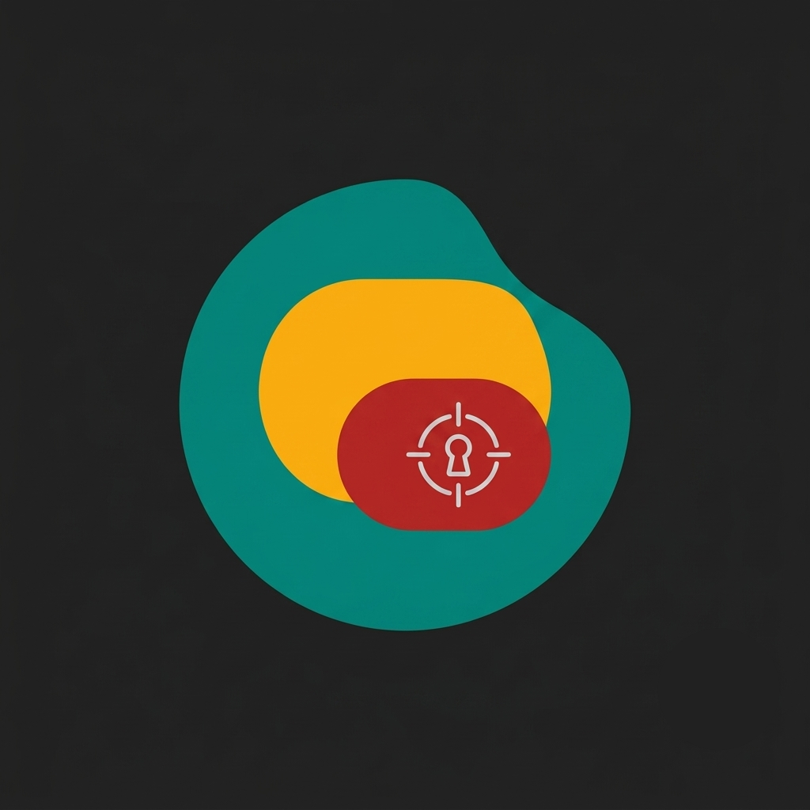

# KeyOut

<p align="center">
  
</p>

<p align="center">
  <strong>A fast, private chroma-key cutout tool that runs entirely in your browser.</strong>
</p>

<p align="center">
  <a href="#getting-started"></a>
  <a href="#android-build"></a>
  <a href="#technology"></a>
  <a href="#privacy"></a>
</p>

<p align="center">
  Open an image, tap the background colours you want to remove, refine their edges, and download a transparent PNG—without uploading the image anywhere.
</p>

---

## What it does

KeyOut is a focused single-page editor for removing flat or evenly lit backgrounds from photos. It uses a chroma-key workflow: select one or more background colours directly from the image, adjust the cutout, then export the result with alpha transparency.

### Highlights

- **Local-first processing** — source pixels stay in the browser; the editor uses the Canvas API rather than a remote image service.
- **Multi-colour keying** — remove up to eight sampled colours from the same image.
- **Independent tuning** — each picked colour keeps its own **threshold** and **edge softness** settings.
- **Full-resolution export** — interaction is optimized with a preview capped at 1400px on its longest side, while the final PNG is rendered from the original-size canvas.
- **Touch-friendly sampling** — press and drag on the image to inspect a magnified colour loupe before committing a sample.
- **Convenient input** — choose a file, drag and drop an image, or paste an image from the clipboard.
- **Android-ready** — a GitHub Actions workflow packages the web app with Capacitor and can build debug or release APKs.

## Getting started

KeyOut has no application build step for the web experience. Serve the repository directory with any static-file server, then open it in a modern browser.

```bash
# Clone your fork or this repository, then enter it.
git clone <repository-url> Keyout
cd Keyout

# Serve the app locally with Node.js.
npx serve .
```

Open the local URL printed by `serve`, select an image, and start sampling background colours. You can also open `index.html` directly in a browser, though a local server is recommended for browser features that expect an HTTP origin.

### Use the editor

1. **Add an image** using **Choose photo**, drag and drop, or paste from the clipboard.
2. **Tap or click a background colour** in the preview. A loupe helps confirm the sampled pixel.
3. **Add more colours** for shadows, gradients, or separate backdrop tones.
4. **Select a swatch** to adjust its Threshold and Edge softness independently. Tap the selected swatch again to return the sliders to defaults for the next sample; double-click a swatch to resample its colour.
5. Use **Undo** or **Reset** when needed, then choose **Download PNG** to save the transparent result.

> **Tip:** KeyOut produces the cleanest cutouts when the background is flat, evenly lit, and visually distinct from the subject.

## Privacy

Images are decoded and processed with in-page browser APIs. The application code contains no upload endpoint or image-processing service: edits and PNG generation happen in the local browser session. This makes KeyOut well suited to quick, private cutouts, while still requiring the usual care when choosing where to store or share the downloaded file.

## Android build

The repository includes a manually dispatched GitHub Actions workflow at [`.github/workflows/Build-app-dynamic-color.yml`](.github/workflows/Build-app-dynamic-color.yml). It:

1. installs Node.js 22 and the npm dependencies;
2. copies the static web files into Capacitor's `www` directory;
3. creates and syncs an Android Capacitor project;
4. injects an Android 12+ Material You colour bridge and a download bridge;
5. generates Android icon assets from `logo.png`; and
6. builds either a debug or release APK and uploads it as a workflow artifact.

To run it in GitHub, open **Actions → Build APK v3 (nav preserved) → Run workflow**, then select `debug` or `release`. A release APK produced by this workflow is unsigned; signing and distribution configuration are intentionally left to the app owner.

For local Android preparation, install the declared dependencies and sync Capacitor after adding the Android platform:

```bash
npm install
npx cap add android
npm run sync
```

> The Android platform directory is generated during the build workflow and is not committed to this repository.

## Technology

| Area | Choice |
| --- | --- |
| Editor | Single HTML document with vanilla JavaScript and CSS |
| Image pipeline | Canvas API and `ImageData` alpha compositing |
| Preview | RequestAnimationFrame-rendered preview, capped at 1400px on the longest side |
| Mobile shell | Capacitor 8 with Android, Filesystem, and Splash Screen packages |
| CI | GitHub Actions with Node.js 22 and JDK 21 |

## Project structure

```text
.
├── index.html                              # KeyOut UI, chroma-key algorithm, and export flow
├── logo.png                                # Source artwork used for Android icon generation
├── package.json                            # Capacitor packages and sync command
├── capacitor.config.json                   # Capacitor app identity and Android configuration
└── .github/workflows/
    └── Build-app-dynamic-color.yml         # On-demand Android APK build
```

## Development notes

- There is currently no automated test suite or web bundler configured.
- The `sync` npm script delegates to `cap sync android`; it expects an Android platform to have been created first.
- The project does not currently include a license file. Add one before redistributing the code under a specific license.

## Contributing

Small, focused improvements are welcome. Please keep the editor lightweight, preserve on-device image processing, and verify the upload, sampling, slider, and PNG-download paths in a browser before opening a pull request.
